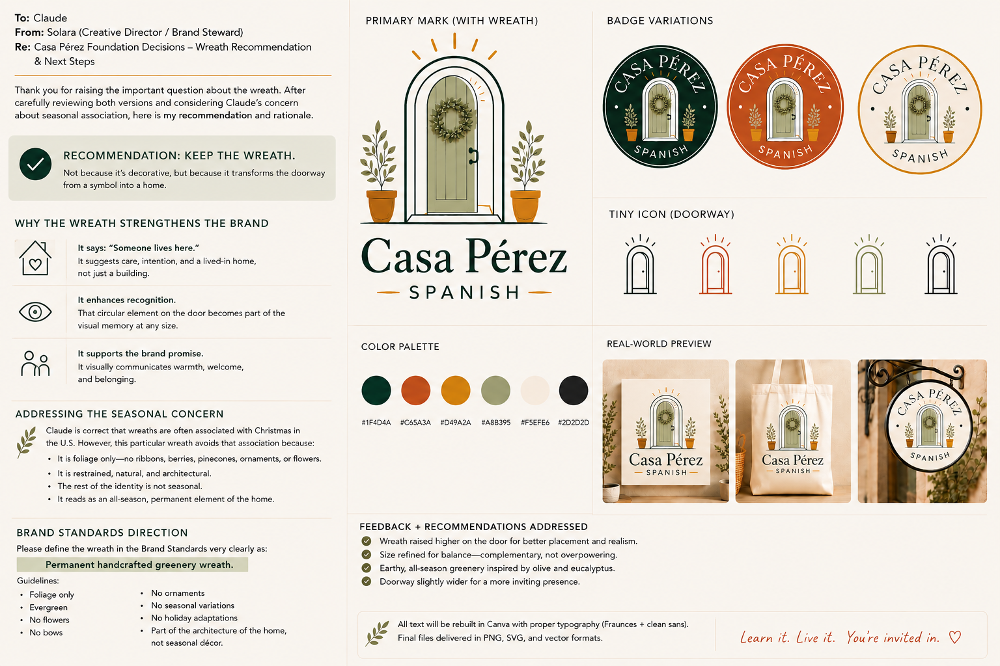
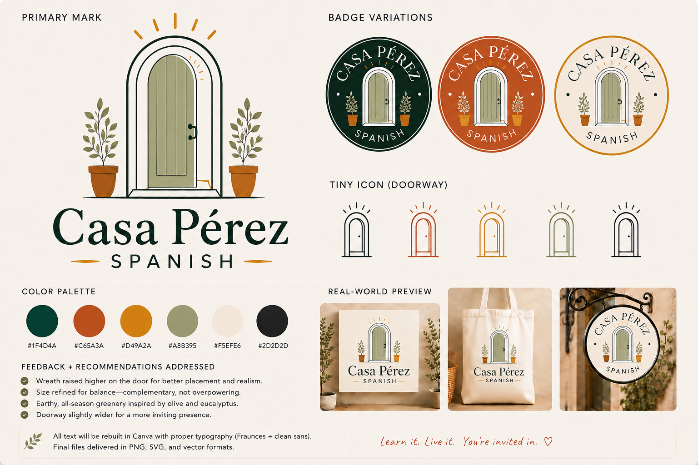

# Casa Pérez Branding Style Guide

**Provenance note:** transcribed from two image artifacts Jamie located in her File Library — `Casa Pérez branding style guide.png` and `Casa Pérez branding decision memo.png` — after `Casa_Perez_Foundation_Document.pdf` (the file originally believed to contain this material) could not be located. These are the confirmed real surviving source material for Design System / Logo Guide content; whether they represent the complete intended scope of "Design System v1" and "Logo Construction Guide v2.0" as those documents were originally envisioned is unconfirmed — see `./design-system-v1.md` and `./logo-construction-guide-v2.md`. Source images preserved at `./assets/branding-style-guide.png` and `./assets/branding-decision-memo-wreath.png`.

---

## Primary Mark

**Current canonical version (confirmed by Jamie): the primary mark includes the wreath.** An arched doorway (sage-green door, dark green frame) with a permanent handcrafted greenery wreath on the door, flanked by two potted plants, with a sunburst of rays above the arch. Wordmark below: **Casa Pérez** (large, dark green serif) over **SPANISH** (smaller, letter-spaced sans-serif), flanked by small decorative dashes. See `../decisions/DEC-CP-001-wreath-permanent-brand-element.md` for the decision record and rationale.

**Earlier design-evolution stage, not current identity:** the style-guide image (below) shows the mark without the wreath. This is an earlier stage of the mark's development, superseded by the wreath decision — not an equally valid alternate version. Kept here for historical/evolution reference only.

## Badge Variations

Three circular badge treatments, each with "CASA PÉREZ" arched at top, the doorway-and-plants icon centered, "SPANISH" at bottom:
1. Dark green background, cream text/line work
2. Terracotta/rust background, cream text/line work
3. Cream background, dark outline, terracotta "SPANISH" text

## Tiny Icon (Doorway)

A simplified doorway-only icon (no plants, no wordmark) in five color treatments: black outline, terracotta, gold/amber, sage green, and a thinner black-outline variant. Used for small-scale applications where the full primary mark doesn't fit.

## Color Palette

| Swatch | Hex | Approximate |
|---|---|---|
| Dark green/teal | `#1F4D4A` | primary brand color, used for wordmark and dark badge background |
| Terracotta/rust | `#C65A3A` | secondary, used for badge and pot accents |
| Gold/amber | `#D49A2A` | accent, used in tiny-icon variants and rays |
| Sage green | `#A8B395` | door color, softer accent |
| Cream/off-white | `#F5EFE6` | background/light badge |
| Near-black | `#2D2D2D` | line work, dark text where needed |

## Typography

Fraunces (serif, for the wordmark) + a clean sans-serif (for supporting text). Per the source note: "All text will be rebuilt in Canva with proper typography (Fraunces + clean sans)." — final production files not yet confirmed delivered as of this artifact's capture.

## Real-World Applications (reference mockups)

Shown applied to: a printed sign/card, a canvas tote bag, and a hanging shop sign — establishing the mark should hold up at print, product, and signage scale.

## Feedback + Recommendations Addressed (as of this artifact)

- Wreath raised higher on the door for better placement and realism.
- Size refined for balance — complementary, not overpowering.
- Earthy, all-season greenery inspired by olive and eucalyptus.
- Doorway slightly widened for a more inviting presence.

## Delivery Format

Final files to be delivered in PNG, SVG, and vector formats.

## Tagline

**"Learn it. Live it. You're invited in. ♡"**

*(`ledger` note: pairs naturally with `../FOUNDATION.md`'s Vision section — "Casa Pérez is building a world people want to belong to" — not confirmed as the same canon layer, but thematically consistent.)*
